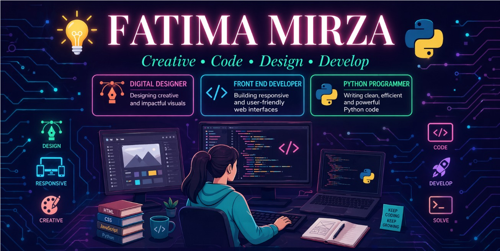

  

<h1 align="center">Hi 👋, I'm Fatima Mirza</h1>
<h3 align="center">A beginner Python programmer from Pakistan</h3>

---

- 🌱 I’m currently learning **Python and Jupyter Notebook**
- 💻 I work with **Anaconda** for data analysis and coding
- 🧠 Tools I use: Python, Jupyter Notebook, Anaconda, Adobe Illustrator
- 📫 You can reach me at **mirzafatima.22222@gmail.com**

---

### 🧰 Languages and Tools:

  
  
  
  

---

### 📈 GitHub Stats

  
  <img src="https://github
