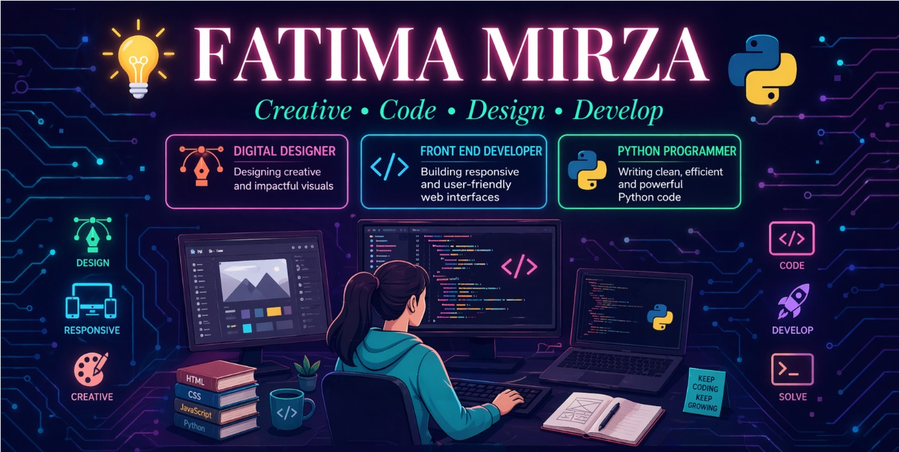

  

<h1 align="center">Hi 👋, I'm Fatima Mirza</h1>
<h3 align="center">Data Analyst | Frontend Developer | Digital Designer</h3>

  

---

## 🌐 Connect with me

  
  
  
  

---

## 👩‍💻 About Me

🚀 I’m a **Data Analyst**, working with **Python, Jupyter Notebook & Anaconda**  
🎨 I create designs using **Canva & Adobe Illustrator**  
💻 I build responsive websites using **HTML, CSS, and JavaScript**

---

## 📌 What I Do

🔭 Working on **Data Analysis Projects**  
🌱 Learning **Advanced Data Visualization**  
💬 Ask me about **Python, HTML, CSS, JS**

---

## 🧰 Languages and Tools

---

## 🔥 My GitHub Stats

    
  
  

